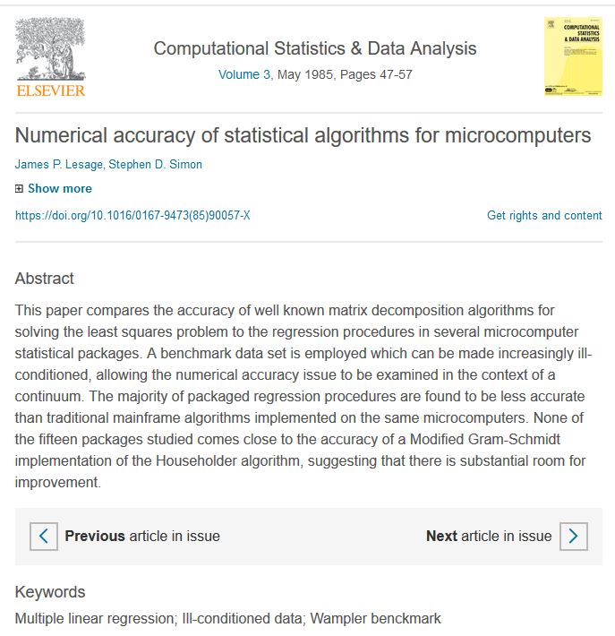

<!--- reference_doc: ../doc/template2.pptx --->

### "What's the best statistical package for you?"

* The big four
  + R: powerful, but difficult to learn
  + SAS: powerful, but very expensive
  + SPSS: easy to use, but lags behind the others
  + Stata: good compromise between SAS and R
* Historical development
* Strengths and weaknesses and where you can learn more
* Never Excel. Never, never, never
* Other software

You have many choices for software to analyze your data: R, SAS, SPSS, and Stata, among others. They are all quite good, but each has its own unique strengths and weaknesses. In this webinar, you'll review the historical development of these four packages, see the areas where they shine and where they fall short, and decide which ones are best for your particular needs. You'll also learn why you should keep your data very, very, far away from Microsoft Excel, and what non-statistical programming skills you should develop.

### How I got started in this area

 

One of the reasons I can talk about this topic so well is that I am old enough to remember many of the historical developments in these statistical software packages. I also have the advantage of co-authoring a series of publications on numerical accuracy in the mid 1980s that included some of the earliest statistical software packages for microcomputers. If it runs on a computer and does statistical analysis, I've probably used it at least once.

### My prejudices

* All these statistical packages are good.
  + Except Excel
* Our classes and lectures should be "software agnostic"
* There are still differences 
  + What suits your style?
  

To some people, the statistical package that they use is as important as their religious or political beliefs, and they will argue about it more than they will about religion or politics.

Whenever someone asks me about what statistical package is best, I tell them that I like R, but that any of the major packages is fine. Well, Microsoft Excel is an exception, which I will talk about later. To some, it 

I believe strongly that all of our statistics classes and lectures should be "software agnostic". That means that they should be equally of interest to anyone, no matter what their favorite package might be. This is a lot more work for the speaker, but it is in the best interest of the students to strike a disinterested perspective.

There are important differences, however, among these packages, and if you don't already have a favorite package, or if you are looking to add a second package to your repertoire, I can help. A lot of this comes down to style.

### Has your choice been made for you?

* Who signs your paycheck?
* Who are you learning from?
* Who do you lean on for support?

Sometimes, you don't get to choose. I know a crackerjack R programmer, Earl, who took a new job where his boss insisted that everything be done in MATLAB. Now, I can argue that this boss was making a big mistake and he should let Earl be Earl. But it's his dime and if he thinks that Earl's time is better spent on a package that Earl doesn't know as well, then that's his call.

Just a quick note to those of you who are independent consultants. If someone asks you to use a package that you don't want to use, double your consulting rate and see if the choice of statistical software is really that important.

If you are part of a degree program, and they are not software agnostic, why fight it? Use their package while you're learning from them, and then decide after you graduate if you want to switch.

If you are in a work environment where you need the help and support of your co-workers, you'll get more help and better help if you use the software package that they use.`

### History of R (part 1 of 3)

* http://blog.pmean.com/history-of-r/
* S written by John Chambers of Bell Labs (1970's through 1990's). Bell Labs
  + Use of functions to extend the language
  + Object oriented features (objects, classes, inheritance)

Bell Labs was the research laboratory for AT&T back when that company held a monopoly on telecommunications in the United States. In the 1970s through the 1990s, John Chambers, a statistician at Bell Labs created a hybrid programming language and data analysis package S.

S was intended for internal use at Bell Labs. The code was made freely available to others but never really caught on.

Some unique features of S were the use of functions to extend the language rather than a separate macro language and the inclusion of certain object oriented features.

Now anyone who was born in 1980 or earlier does not truly understand what object oriented means. That means me. If you are as old as I am, stop pretending that you understand this new-fangled stuff. You don't. I don't. The non-technical explanation is that an object-oriented programming approach is more difficult to learn, and your first object oriented program is a lot more difficult to write, but from the second program onward, if you do it right, it becomes a lot easier. The code is cleaner, easier to maintain, and easier to debug.

### Footnote: Other notable Bell Labs scientists (from Wikipedia)

* William Shewhart (control charts)
* Claude Shannon (information theory)
* Dennis Ritchie (UNIX, C)
* Bjarne Stroustrup (C++)
* Ingrid Daubechies (wavelet decomposition)
* Persi Diaconis (probability models)
* Trevor Hastie (machine learning)

If I could add a footnote here, Bell Labs provided a lot of other innovations in the programming and statistical world. I can't even begin to summarize their innovations in Physics and Engineering.

### History of R (part 2 of 3)

* S-plus, Statistical Sciences, Inc. (1988)
* Ross Ihaka and Robert Gentleman. R: A language for data analysis and graphics. Journal of Computational and Graphical Statistics, 5(3):299-314, 1996. Available at https://www.stat.auckland.ac.nz/~ihaka/downloads/R-paper.pdf
* Currently maintained by R Foundation for Statistical Computing
* Vance, Ashlee. Data Analysts Captivated by R’s Power. The New York Times, 2009 (January 6). Available at http://www.nytimes.com/2009/01/07/technology/business-computing/07program.html.

A commercial product, S-plus, was developed by Statistical Sciences, Inc. in 1988 and grew to great popularity.

Around the same time, Ross Ihaka and Robert Gentleman developed an open source system, R that used the same syntax and structure as S. Their publication in the Journal of Computational and Graphical Statistics in 1996 could be considered the birth of the language, though work had already been done for several years before this.

If you are interested in seeing how big R has become, take a look at this 2009 article in the New York Times.

### History of R (part 3 of 3)

* Revolution Analytics (2007), purchased by Microsoft in 2015
* RStudio (2011)
* tidyverse (2017)

Revolution Analytics was a commercial company that offered enhancements to R like improved documentation and support, parallel processing, and extensions for big data.

RStudio, an excellent IDE (Integrated Development Environment) appeared on the scene in 2011. RStudio offers both free and commercial versions of their IDE. The commercial versions offer built-in support and extra features.

Both Revolution Analytics and RStudio follow the model of RedHat and show how you can make good money on a product that is given away for free.

A group of user contributed packages, many written or co-written by Hadley Wickham and known by the collective name "tidyverse," simplify the process of data management. Anyone who was confused by the apply, lapply, sapply, and tapply functions in R will love the way that group summaries are handled in the dplyr package, for example.

***
### History of SAS (part 1 of 2)

* http://blog.pmean.com/history-of-sas/
* Statistical Analysis System. Anthony Barr, James Goodnight, Jane Helwig, and John Sall, North Carolina State University (1960s).
  + Mixture of FORTRAN, PL/1, and IBM Assembler.
* SAS Institute (1976)
* Best places to work awards
  + https://www.sas.com/en_si/news/press-releases/2018/june/fortune-workplace-millennials.html

A team of four statisticians at NC State developed SAS in the mid 1960s. It was written in a mixture of FORTRAN, PL/1, and IBM Assembler. For many years, it could only run on IBM mainframe computers, but for many years, IBM held enough of a monopoly position that it didn't matter.

A corporate structure was developed in 1976 and SAS Institute settled into Cary, North Carolina, in the heart of the Research Triangle.

SAS Institute is routinely listed by places like Fortune magazine as one of the best places to work.

### History of SAS (part 2 of 2)

* First SAS conference (1976)
* C translation (1986)
* JMP (1989)
* R interface (2011)
* SAS University (2014)

SAS has a long history of supporting its users through conferences. The first SAS conference was held in 1976 in Kissimmee, Florida. Every conference has published proceedings available for free on the internet and these papers are a great resource both for beginners and advanced students.

In 1986, SAS was rewritten from top to bottom in C. This allowed SAS to be ported to pretty much any mainframe, minicomputer, or microcomputer.

In 1989, SAS created an entirely new product, JMP (short for John's Macintosh Program) that took advantage of the special graphical features of the Macintosh computer. Today JMP is also available for Windows based systems. 

Around 2011 (I might be off by a couple of years), SAS developed an interface with IML (Interactive Matrix Language) that allows you to run R code.

SAS University was released in 2014. It provides a nearly complete version of SAS that can be used for free for educational but not commercial purposes. I've used SAS University and it is quite good.

***
### History of SPSS (part 1 of 3)

* http://blog.pmean.com/history-of-spss/

* Hadlai Hull, Dale Bent, Norman Nie, Stanford University, later University of Chicago (1968)

* SPSS Incorporated (1975)

* Purchased by IBM (2009)

A development team, originally at Stanford University, developed SPSS in 1968. One of the team members, Norman Nie, moved to the University of Chicago and later development was centered there.

An interesting bit of trivia is that the earliest versions of SPSS were distributed for free, but they distributed the documentation through a traditional publisher. The team got an early indication that they were on to something when they started receiving lots of royalty checks for the SPSS manual.

To avoid tax problems at a non-profit university, a business entity, SPSS Incorporated, was created.

In 2009, SPSS was purchased by IBM.

### History of SPSS (part 2 of 3)

* PSPP (1998)
* AMOS (2001)
* Note: SPSS, not Statistical Package for the Social Sciences

An open source alternative, PSPP, was developed in 1998, with the intent of doing most of the things that SPSS does, including the look-and-feel of the SPSS interface.
 
SPSS Incorporated bought a package for Structural Equations Modeling (AMOS) around 2001.

SPSS was an acronym for Statistical Package for the Social Sciences. It grew to be used by a much wider audience than just the social sciences, so the marketing department decided to promote SPSS with the acronym only and wiped any evidence of what those letters stood for in their promotional literature. This is not unlike the fast food restaurant KFC. It originally stood for Kentucky Fried Chicken, but the marketing folks decided that it would be a good idea to de-emphasize that all of their food was fried.

***
### History of SPSS (part 3 of 3)

* Microcomputer version (1984)
* Windows version (1992)
* Python extension (2005)
* R extension (2008)
  + Note: some dates are approximate.

The original version of SPSS was written entirely in FORTRAN and could be run on a wide range of mainframe computers and minicomputers, unlike SAS, which was originally only able to run on IBM mainframe computers.

SPSS was the first major statistical software package to develop a microcomputer version and was an early adopter of the Microsoft Windows platform.

SPSS had a crude macro language (which is still available) but in 2005 (version 14) added a Python interface that was much easier to use and much more flexible.

Around 2008 (version 16), SPSS developed an extension that would let you run R code within SPSS. It also rewrote the windowing interface 

***
### History of Stata (part 1 of 2)

* https://www.stata.com/support/faqs/resources/history-of-stata/
* Rhymes with data.
* William Gould, Finis Welch, Sean Becketti, StataCorp (1985)
* Unix versions (1988)
* Macintosh (1992)
* Windows (1995)

How you pronounce S-T-A-T-A is a mystery. The website for this package says that it rhymes with D-A-T-A, but that word has two different pronunciations. So, you can call it STAY-ta or STAH-ta. You say tomay-to and I say tomah-to.

The first version of Stata appeared directly on the microcomputer in 1985. The company strived for platform independence and supported Unix in 1988, and the Macintosh in 1992. A Windows version appeared in 1995.

### History of Stata (part 2 of 2)

* Stata Technical Bulletin (1991)
* Stata Users Group meetings (1995)
* Stata Journal (2001)

One of the great appeals of Stata was its interest in publishing cutting edge research. The Stata Technical Bulletin, started in 1991 and replaced by the Stata Journal ten years later, offered a chance for academically oriented researchers to share advanced statistical methodology supported by Stata macros.

Stata has nurtured a large user group community and has held meetings both nationally and internationally since 1995.

### Advantages of R (part 1 of 3)

* Unified system
  + Data management
  + Data analysis
  + Formatting output
  + Macro language

I love R because the code that you learn to manipulate data is the same code that you use to analyze data and the same code you use to format your output and the same code that you use to write macros. This is unique among all the packages that we talk about today (with the possible exception of Python, see below).

SAS, for example, has a macro language with a bizarre set of variables with ampersand and percent sign prefixes. It also takes a fair amount of work to get output from a SAS PROC into a data set. Neither of these is hard, but you have to learn a new and different system in each case.

There are some technical features in R, an object oriented approach and functional programming features that make R code cleaner and easier to maintain. You learn pretty quickly in R that most of the output has a default way of displaying itself (a print method), but you can easily look at it differently with a summary method and a plot method. You can loop through a list of functions just as easily as you can loop through the rows of a data frame.

### Advantages of R (part 2 of 3)

* Simple clean output
* Gorgeous graphs

Most packages throw everything and the kitchen sink into their output. This is done in the (misguided, in my opinion) desire to be all things to all people. The default in R is to print some information, but then require you to dig a bit to get more information. Consider what SPSS does, for example, with its two sample t-test. It gives you the descriptive statistics for each group, the Levene test for homogeneity of variance, and then both the p-value and confidence intervals for the standard t-test and the Satterthwaite approximation. Satterthwaite, if you don't remember, is the approach that uses approximate degrees of freedom when you can't assume or don't want to assume that the two variances are equal. When you ask for a crosstabulation in SAS, by default it provides row percents, column percents and cell percents in addition to cell counts.

R can take advantage of markdown language. This is a system where you embed the code for data analysis into the report that you are producing. If the data changes or you want to tweak an analysis option, just push a button and the entire report is regenerated. Markdown is not an option (or at least not an easy option) in any of the other packages mentioned so far. Markdown is a critical piece in the reproducible research movement. You can do reproducible research without markdown, but markdown makes reproducilbe research so much easier.

Graphs in R are gorgeous, and the default options are almost always good. You can customize your graphs easily, and there are nice little features, like being able to place a formula within a graph. There is a new system, ggplot2, that takes the already gorgeous graphs in R and makes them even nicer.

### Advantages of R (part 3 of 3)

* Cutting edge research
* Very strong user support community
* Plays well with others

If there is a new statistical technique, you can pretty much guarantee that you will see an implementation of it first in R. The reason for this is that anyone getting a PhD in Statistics wants to get their work used by as many people as possible as quickly as possible. So they develop their work as an R package. It doesn't have to get approval from the corporate chain of command at a place like SAS. This is a good thing, mostly, but there is such a thing as being on the "bleeding edge" of research.

All of the other packages talked about today are extensible, but R is by far the easiest. This is one more reason why it has so much of the cutting edge research out there.

While the documentation provided by the R Foundation for Statistical Computing is not the greatest, there is a very active user support community.

R plays well with others. It is easy for other packages like SPSS and SAS to run R code from within their programs. R itself can easily run C++ and Java code.

***
### Disadvantages of R (part 1 of 2)

* R is free
  + Good (not great) documentation
  + Good (not great) Quality Control
  + Unevenness in user contributed packages
* Limited ability to select analyses from a menu (R Commander)

I listed the fact that R is free among the disadvantages. It is actually the first ADVANTAGE that other people cite about R, but free software is not free. You pay more for free software in labor, typically. The help facilities in 
R are good, but they can't compare to the professionally produced documentation of the other three packages. R does testing for the base package, but the level of testing for user supported packages is uneven.

The quality of the user contributed packages is also uneven. Some are great, but some are only good, and others are mediocre. None are particularly bad. Not Excel-bad, anyway.

Another problem with user contributed packages is that some of them get orphaned over time.

R has no serious menuing system built in. You can download an add-on product, R Commander, that will cover some of the basic analyses that you would find in your Stats 101 class, but if you want to use R, you have to learn how to program it.

### Disadvantages of R (part 2 of 2)

* Entire data set must fit in working memory
* Maddeningly inconsistent naming
  + Case sensitive, dot.delimited, underscore_delimited, CamelCaseDelimited.
* Uneven quality of user contributed packages, http://blog.pmean.com/which-r-package/

R requires that the active data set be stored in working memory. Working memory (RAM) is quite big these days and data sets with millions of rows are easy to work with. But in the era of "big data," this limitation might be a drawback. There are work-arounds, but they require a lot of tedious programming.

R can be infuriating at times. There is no rhyme or reason in how it choose names, even within the base package. It gets worse because R is case sensitive. There are three possible delimiters when you have two or more words in a function or variable name. You can delimit using dots, underscores, or CamelCase. R uses a mix of all three.

There are over ten thousand user contributed packages, which by itself is a big disadvantage, but the qulaity of user contirbuted packages is uneven. There are no bad packages, really, but some are mediocre. I have some informal guidance on how to pick a good package, but the big advantage of a commercial package is that they have a minimum standard that they apply on any add-ons that theythemselves release.

***
### Where to learn more about R (part 1 of 2)

* Internal documentation
* CRAN, https://cran.r-project.org/
  + Vignettes
  + Task views, https://cran.r-project.org/web/views/

You can find a nice help system built into R. The quality is a bit uneven at times and some of the help files can only be understood by a computer programmer. Sometimes, the doucmentation is a bit too terse for my tastes. One nice thing is that almost every help file has a useful set of examples that you can quickly dumpp into R to tinker with.

Th R foundation maintains a website, CRAN (Comprehensive R Archive Network), with information about how to install R, the user manuals, an FAQ, and other useful resources.

Many, but not all, R packages come with a vignette. If you are lucky enough to find a vignette, read it carefully, re-read it, and then read it again. Vignettes are a great way to learn and the quality is much better than what you might find in the help files for your package.

If you're not sure what R package to use, there are task views devoted to broad areas like time series analysis and natural language processing. These task views will mention every available package in an area, but won't tell you whether they are great, just good, or downright mediocre.

### Where to learn more about R (part 2 of 2)

* Books
* Very strong user support community
  + R-help, https://stat.ethz.ch/mailman/listinfo/r-help
  + Stack Overflow, https://stackoverflow.com/questions/tagged/r
  + R bloggers, https://www.r-bloggers.com/
  + R user groups, https://blog.revolutionanalytics.com/local-r-groups.html

There are lots of books written about R. I don't have a favorite, but everyone that I've ever read has been quite good.

R has a very active user support community. These people offer free advice and assistance, but keep in mind that they will help you on their terms only and get quite crotchety if you make unreasonable demands.

R-Help is a traditional mailing list where people pose questions by email and get answers back by email. There is a web interface via nabble.

The R community is very active on Stack Overflow. Stack Overflow is a general web site where people can post questions and get answers to a wide range of technical topics. The website is easily searchable and the questions and answers frequently pop up when you Google a detailed question about R. In particular, if you get a weird error message, cut and paste it into Google and you'll probably find that someone else has already asked about that weird error message and gotten a dozen helpful responses.

There are 750 R bloggers that contribute to a consolidation site, R-bloggers. The quality of the blog writing is quite high and these bloggers cover both introductory and advanced topics.

***
### Advantages of SAS (part 1 of 2)

* Powerful, comprehensive
* Thorough QC
* Outstanding documentation

SAS provides a broad and comprehensive coverage of statistical methodologies. They are not always first, but they are early, and their work is well vetted before it is released.

SAS has a big QC department, and that doesn't mean that everything SAS releases is perfect, but they come pretty darn close.

SAS also spends a lot of time and money on their documentation, and it is all on the web. When you Google a SAS question, their documentation pops up right away and it almost always answers your question.

### Advantages of SAS (part 2 of 2)

* Extensible (but messy)
* Gorgeous graphs (but difficult to customize).

You can extend SAS with macros. it isn't as easy as you might like, but you can do some simple automation tasks like storing key information in a macro variable that you can re-use easily. You can loop through variable lists and run data steps and procedures inside a function).

Graphs have changed a lot in SAS over the years, but the default options are almost always close to publication quality. The last few tweaks, though, require some rather complex code. I have not spent a lot of time with sgplot, but it looks to be a big improvement over gplot.

***
### Disadvantages of SAS (part 1 of 2)

* Expensive
* Difficult to learn

For an organization, SAS is priced reasonably, assuming that you have a large number of users, but the price for an individual is outrageously high.

SAS is difficult to learn. Not as difficult as R, but still an uphill battle. The commands are simple enough, but you have to master a different set of commands for the data setup versus the procedures. The statistical procedures have a dizzying array of options, though the default choices are usually quite good.

### Disadvantages of SAS (part 2 of 2)

* Limited menu options (SAS Enterprise)
* Proprietary format
  + https://stats.idre.ucla.edu/other/mult-pkg/faq/how-do-i-use-a-sas-data-file-in-stata/
  + https://stats.idre.ucla.edu/other/mult-pkg/faq/how-do-i-use-a-sas-data-file-in-spss/

If you were hoping to run SAS from a menu system, there is a product called SAS Enterpise, but it is an extra cost, and from what I can tell it is not as comprehensive as the menu choices available in SPSS or Stata.

SAS Stores its data in a proprietary format and hides the details from its competitors. That means that if you want to use a SAS data set, you have to convert it to an exportable format within SAS. If someone sends you the standard SAS file, and you do not have SAS on your computer, you will have a struggle on your hands. There are people who have worked form incomplete documentation and reverse engineering to get this to work, but it is not a slam dunk.

In fairness, it is work to convert from a binary data file from one program into a binary data file of another program. The solutions are more robust, however, with anything except SAS.

***
### Where to learn more about SAS (part 1 of 2)

* Stack overflow
  + https://stackoverflow.com/questions/tagged/sas
* SAS support community
  + https://communities.sas.com/
* SAS documentation
  + https://support.sas.com/en/documentation.html

There is an external support network for SAS, but not as extensive as that for R. Stack Overflow is a nice place to pose your SAS questions, but you might find better luck at the internal discussion board run by SAS Institute.

The documentation that SAS provides may be all that you ever need. There area dizzying arroay of options, but the documentation covers them completely and accurately. The programming examples are outstanding. If you are into formulas, SAS will provide enough detail that you could almost program things yourself. The documentation is all online and easily searchable from the inside or from an outside search engine like Google.

### Where to learn more about SAS (part 2 of 2)

* SAS books
  + https://support.sas.com/en/books.html
* SAS training/certification
  + https://www.sas.com/en_us/training/overview.html
* SAS User Groups,
  + https://www.sas.com/en_us/connect/user-groups.html
* SAS meetings
  + https://www.sas.com/en_us/events.html 

Almost all books about SAS are found in a publishing arm of SAS Institute. The prices are reasonable and the authors are prominent researchers. The books I have read are all of a uniformly high quality.

There are a large number of user groups for SAS, and they offer local regional, and national meetings. SAS supports its user groups very well and they send out speakers frequently from their home office in Cary, NC to remote locations. SAS offers online classes as well. The regional and national meetings are a great way to get some of the official SAS training classes. SAS offers various certifications. The courses and certifications are not cheap, but they are good.

***
### Advantages of SPSS (part 1 of 2)

* Comprehensive menu system
* Wizards
  + Date/time calculations
  + Longitudinal data management

SPSS does a great job of making the same features available in programming statements (SPSS syntax) and through a menu system. I have successfuly trained many people to use SPSS who would never be capable of using a programming language and after just a little bit of work, they can do a fair amount of work independently.

SPSS offers wizards to guide you through the various options. Date values are tricky, so SPSS automates conversion from strings to date, extracting parts of a date, or calculating time intervals. Longitudinal data is also very tricky, and SPSS guides you through how to convert from a tall and thin format to a short and fat format and vice versa. The wizards are super easy to use.

### Advantages of SPSS (part 2 of 2)

* Organized output with tabs
  + Jump to a section
  + Re-arrange sections
  + Delete sections
  + Syntax precedes relevant output
* Customizable graphs

The output in SPSS is well organized and you can jump from spot to spot, move things around, and (my favorite) delete things you no longer need. SPSS includes the syntax for every step in your data analysis and most of the steps in your data management, even if you use the menu system. The syntax is just a bit cryptic, but even a beginner can peek at it and figure out what was done when you look at your output six months down the road.

The default options for some graphs don't make much sense, but SPSS gives you a nice point and click interface for customizing things.

***
### Disadvantages of SPSS

* Slow to adopt latest developments
* Expensive
* Limited training resources

SPSS is a little slow to adopt new statistical methodologies. In some areas (like missing values), they are current, but in other areas (like survival models), they lag five to ten years behind their competitors.

SPSS is expensive, though not as bad as SAS.

There are fewer training resources for SPSS, compared to other packages, though SPSS does not need as much training as other packages might.

***
### Where to learn more about SPSS

* Documentation
  + https://www-01.ibm.com/support/docview.wss?uid=swg27049428
* Books
* Websites
  + http://www.spsstools.net/en/
* SPSSX email group
  + http://spssx-discussion.1045642.n5.nabble.com/

The documentation that comes with SPSS is difficult to navigate. It is also written primarily from a syntax perspective, so you won't get much help with the menus and the point and click interface. Maybe you won't need as much documentation for these things, but it is still disappointing.

There are a few books available for SPSS and the ones I've read are good, but not great. I do not have a favorite SPSS book.

Websites other than those of SPSS are few and far between. The one good one is by Raynauld Levesque, which provides useful syntax and macros.

There's also an email discussion group, which you can also follow on the nabble website.

***
### Advantages of Stata

* Clean syntax, good menu system
* Extensible (ado files)
* Broad, comprehensive coverage

I've only used Stata for a few specialized applications. My general impressions are positive, but are based on a limited perspective.

Stata has a simple syntax and is easy to use for a command driven system. The menus in Stata cover many of the options available from syntax, much better than SAS or R, for sure.

You can do a lot of interesting things in Stata using ado files.

The programmers at Stata work very hard to keep Stata current with the new developments in Statistics. The coverage is quite broad and close to comprehensive.

***
### Disadvantages of Stata

* Expensive (but not as bad as SAS)
* Entire data set must fit in working memory

Stata is a commercial product, but the price is not outrageous.

Like R, Stata requires that the active data set be stored in working memory. Working memory (RAM) is quite big these days and data sets with millions of rows are easy to work with. But in the era of "big data," this limitation might still be a drawback.

I can't find too much to complain about with Stata, which is partly because I have not used it enough to discover all its annoyances. It is also a reflection of its more recent heritage. It was developed first on a microcomputer platform and does not have all of the baggage that comes from systems like SAS and SPSS that were ported from mainframe computers. It also has a carefully controlled development environment, unlike R. R is the proverbial camel (a horse developed by a committee).

***
### Where to learn more about Stata

* Stat journal
  + https://www.stata-journal.com/
* Stata conferences
  + https://www.stata.com/meeting/
* Books
  + https://www.stata.com/bookstore/
* Statalist
  + https://www.statalist.org/

The Stata Journal has articles by prominent statisticians who want to illustrate advanced statistical methods using Stata macros.

Stata has many national and international conferences.

If you are looking for books, Stata has a publishing arm, much like SAS.

There is also a question and answer forum, Statalist, that Stata runs.

***
### Never use Excel (part 1 of 2)

* Reinhart and Rogoff error
  + http://theconversation.com/the-reinhart-rogoff-error-or-how-not-to-excel-at-economics-13646
  + https://www.bloomberg.com/news/articles/2013-04-18/faq-reinhart-rogoff-and-the-excel-error-that-changed-history
  + https://www.nytimes.com/2013/04/19/opinion/krugman-the-excel-depression.html

Many people use Microsoft Excel for their data analysis needs, but there are a lot of well documented deficiencies in Excel. Some of these are characteristic of any spreadsheet, but others are specific to Microsoft.

Excel has more flexibility in selecting information and that makes it easier to select the wrong range of information. There is a famous (or should I say infamous) error published by two economists, Carmen Reinhart and Kenneth Rogoff, where they presented historical data that seemed to imply that whenever a country's debt load exceeded 90% of the gross domestic product,  bad things happen. The problem is that the data that they cited accidentally left out the three countries that were most inconsistent with their hypothesis. It was not intentional, and in fact, it is super easy to select the wrong range. Worse still, it is very difficult for an outsider to discover errors like that through an audit because the cell ranges are hidden behind the numbers.

### Never use Excel (part 2 of 2)

* Other horror stories
  + EUSpRIG
  + https://people.umass.edu/evagold/excel.html
  + https://www.cremeglobal.com/the-spreadsheet-problem-in-data-science/
  + https://www.sciencedirect.com/science/article/pii/S0167947308001606
* Poor internal coding
* Poor auditability
* Poor graphics capabilities

There are lots of examples like this error, and you should visit the EUSpRIG (European Spreadsheet Risk Interest Group) website and some of the others listed here, if you don't believe me.

If you run tests on some of the statistical algorithms used by Excel, you will find lots of examples of poor numerical precision and out and out errors. Some of these have gotten fixed over time, but the quality of the programming in Excel is suspect.

If you have to review the work that someone else did in Excel, you will find it very difficult. Excel hides most of the details of the statistical analysis behind the number values in a cell. The code is cryptic, there are very similar names for quite different functions, and the usage of these functions is inconsistent.

Excel is a great product for its initial application area, financial calculations, but it does not do so well in statistical analysis.

Some people use Excel just to produce graphs, but this is also a mistake. Graphs in Excel almost never look nice on the first run through, and customizing them is difficult. It is easy to select the wrong range and get an incorrect graph. The graphic types in Excel are limited and include a lot of puffery like 3D bar charts and exploding pie wedges.

***
### What about Python? 

* Just a programming language
  + Free, easy to learn, extensible
* Key extension: SciPy, https://scipy.org/index.html
  + NumPy, Array and matrix calculations
  + SymPy, Symbolic mathematics
  + Scikit-image, Image processing
  + Scikit-learn, Machine learning algorithms
  + Pandas, Data management and analysis
  + Matplotlib, Graphical dispay`

Python has gotten a lot of attention as an alternative to the big four that we just finished discussing.

Python, by itself, is just a programming language. I have not used it yet, but it is on my list of things to do when my life gets calmer. 

Pyhton is easy to learn, and has a clean and simple syntax. But most importantly to you, Python is easily extensible. 

The key extension that you would be interested in is SciPy, a set of tools for various quantitative analyses. It covers a broad range of topics.

***
### Non-statistical software that (some) statisticians should know

* git, https://github.com/pmean/best-statistical-package

* Jupyter

* Linux

* SQL

There are some non-statistical software packages that I want to recommend. Not everyone needs these packages, but they are still worth looking at.

Git is a version control system. It integrates easily with R, works okay with others. This is a great tool for working with a team of data analysts and for sharing your results.

Everything I do these days is stored on a site, github, that uses git software. It is free for amateurs like me, but there are commercial versions for larger enterprises. This talk is archived on my github site.

Jupyter notebooks offer a literate programming interface. Good for reproducible research. Similar to the RMarkdown system. I have not used Jupyter yet, but it also is on my short list.

Linux is an operating system that is open source and has many features that compete with the commercial systems of Microsoft and Apple. It is also a common back end for things like web servers. Certain research communities, such as genetics, have adopted Linux as a platform for distributing software tools. You can use these tools without a details knowledge of Linux, but even a small bit of understanding helps a lot.

If you work with relational databases, you should learn SQL, even if you have access to a database administrator. SQL is a very easy language to learn, but also very powerful. Ideal for large and complex data structures. It knows how to work through terayte and larger tables and can handle complex interrelationships among tables very gracefully.

***
### Conclusion

* Remember who is signing your checks
* R: powerful, but difficult to learn
* SAS: powerful, but very expensive
* SPSS: easy to use, but lags behind the others
* Stata: good compromise between SAS and R
* Don't be dogmatic
  + Steve Simon. Fighting SASism. PMean blog, October 30, 2018. http://blog.pmean.com/fighting-sasism/

One last note. Don't be too dogmatic about the statistical package that you use. I talk about the sin of SASism on my blog, a belief that if it isn't in SAS, it isn't important. This is a sin that the folks of the R side of the divide are also guilty of, though Rism just doesn't have the same ring to it.

This is what we've talked about so far. Any questions?

